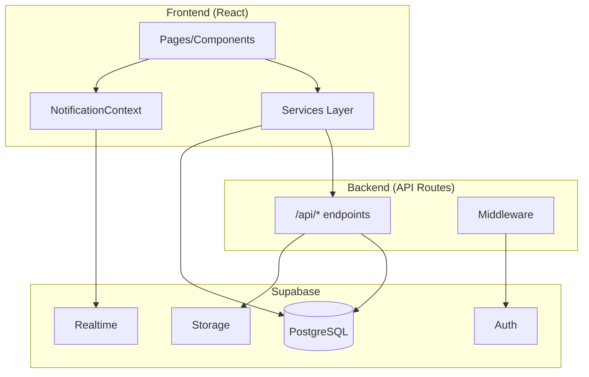
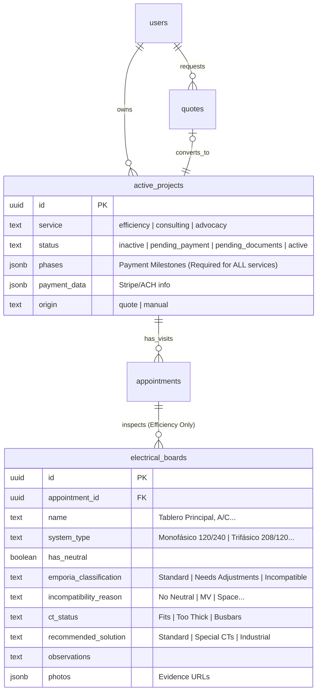

# TeraVolta System Architecture

This document provides a comprehensive analysis of the TeraVolta system architecture, covering the application layers, database design, and service-specific flows.

---

## Table of Contents
- [Application Layers](#application-layers)
- [Database Architecture](#database-architecture)
- [Service Flows](#service-flows)
- [Field Service Module](#field-service-module)
- [Related Documentation](#related-documentation)

---

## Application Layers

### Technology Stack

| Layer | Technology |
|-------|------------|
| Frontend | Next.js 15 (App Router), React 18, TypeScript |
| Styling | Vanilla CSS, Tailwind (minimal) |
| Backend | Next.js API Routes, Supabase |
| Database | PostgreSQL (Supabase) |
| Auth | Supabase Auth (Email/Password + Magic Links) |
| Storage | Supabase Storage |
| Email | Resend API |
| Realtime | Supabase Realtime |

### Architecture Diagram

### API Layer

**Location:** `app/api/`

14 API endpoints handling privileged operations:

| Category | Endpoints |
|----------|-----------|
| Auth/Onboarding | `activate-account`, `create-magic-link`, `update-user-password`, `verify-token` |
| Email | `send-email`, `send-onboarding-email`, `send-invoice`, `notify-existing-client`, `resend-onboarding` |
| Data Operations | `create-project`, `create-technician`, `assign-technician`, `create-notification` |
| Public | `availability` |

> See [API Reference](./API_REFERENCE.md) for full documentation.

### Services Layer

**Location:** `app/services/`

8 client-side services providing clean abstractions:

| Service | Purpose |
|---------|---------|
| `activeProjectService` | Project CRUD, documents, technician assignment |
| `appointmentService` | Field visits, status updates, incidents |
| `emailService` | Email dispatch with preference checking |
| `notificationService` | In-app notifications with preference enforcement |
| `quoteService` | Quote request management |
| `rescheduleService` | Customer self-rescheduling |
| `reviewService` | Technician ratings and reviews |
| `technicianService` | Technician profiles and availability |

> See [Services Reference](./SERVICES_REFERENCE.md) for full documentation.

### Middleware & Security

**File:** `middleware.ts`

- Protects all `/portal/*` routes server-side
- Validates Supabase Auth session
- Redirects unauthenticated users to login

### Notification System

Components providing real-time notifications:

| Component | Role |
|-----------|------|
| `NotificationProvider` | Context provider with Realtime subscription |
| `NotificationCenter` | Header dropdown UI |
| `NotificationService` | Preference-aware notification creation |

> See [Notification System](./NOTIFICATION_SYSTEM.md) for full documentation.

---

## Database Architecture

> [!IMPORTANT]
> **Unified but Specialized**: The system uses shared tables (`active_projects`, `appointments`) but triggers specialized flows based on the `service` type.
> *   **Efficiency**: Quote -> Inspection (Multi-Board) -> Pricing (Phased).
> *   **Consulting/Advocacy**: Inquiry -> Admin Board (Internal) -> Proposal.

---

### ER Diagram
The schema supports all services. The `electrical_boards` table is a specialized extension for Efficiency inspections.

---

## 2. In-Bound Data Flows (Detailed Field Specifications)
The following tables list exactly what data is collected from the client for each service type.

> [!NOTE]
> **Unified Onboarding Protocol**: ALL services now trigger **Immediate Onboarding** after form submission. The client gets a Portal Account *before* any Admin review.

### A. Energy Efficiency (The Quote Flow)
*Source: `app/quote/page.tsx`*
This flow is simplified to collect only what the client knows. **No technical data.**

| Step | Field Category | Fields / Logic |
| :--- | :--- | :--- |
| **1. Client Type** | `clientType` | **House**, **Apartment**, **Commerce**, **Building / Common Areas**, **Hotel**, **Large Industry** |
| **2. Contact** | Contact Info | Name, Email, Phone |
| | `company` | **Conditional**: Required if Type is NOT House/Apartment. |
| **3. Location** | Address | Address, City, State. (Zip Code optional) |
| **4. Bills** | `files` | **Upload Only**. No ranges, no values. Just the files. |
| **5. Details** | *If Residential* | `propertyType` (House/Apt), `propertySize` (Approx). |
| | *If Commercial* | `facilityType` (Office, Retail, Industrial, etc), `operatingHours` (Optional). |
| **6. Message** | `message` | Optional comments or constraints. |
| **7. Scheduling** | **Booking** | **Immediately after submission**, user selects Date/Time for Inspection. |
| **8. Success** | Onboarding | User is redirected to `/onboarding`. |

> [!WARNING]
> **STRICTLY REMOVED FIELDS**:
> *   Current Bill Range ($)
> *   Device Mode (Purchase/Rent)
> *   Connectivity (WiFi/3G)
> *   System Type, Voltage, Breakers
> *   **Price** (No pricing is shown)

### B. Strategic Consulting (The Inquiry Flow)
*Source: `app/inquiry/InquiryForm.tsx` (Service: Consulting)*

| Field Name | Type | Options / Validation |
| :--- | :--- | :--- |
| `fullName` | Text | Required |
| `email` | Email | Required |
| `phone` | Phone | Required |
| `company` | Text | **Highly Recommended** (B2B Service) |
| `projectDescription` | TextArea | Required (500 chars limit) |
| `timeline` | Select | Immediate, 1 Month, 2-3 Months, >3 Months |
| `budget` | Select | <$5k, $5k-$15k, $15k-$50k, >$50k |
| `address` | Text | Required (Project Location) |
| `city` | Text | Required |
| **Post-Submit** | **Onboarding** | **Immediate Account Creation**. Logic matches Efficiency. |

### C. Advocacy / Service Quality (The Inquiry Flow)
*Source: `app/inquiry/InquiryForm.tsx` (Service: Advocacy)*

| Field Name | Type | Options / Validation |
| :--- | :--- | :--- |
| `fullName` | Text | Required |
| `email` | Email | Required |
| `phone` | Phone | Required |
| `propertyType` | Select | Residential, Apartment, Business, Office, Industrial |
| `projectDescription` | TextArea | Required (Describe the dispute/issue) |
| `address` | Text | Required (Affected Service Location) |
| `city` | Text | Required |
| **Post-Submit** | **Onboarding** | **Immediate Account Creation**. Logic matches Efficiency. |

---

## 3. Manual Project Creation (Admin Wizard)
For projects created internally by Staff. The Wizard must collect data equivalent to the Web Forms.

| Field Category | **Efficiency** | **Consulting** | **Advocacy** |
| :--- | :--- | :--- | :--- |
| **Client** | Select or Create New | Select or Create New | Select or Create New |
| **Location** | **Full Address** (Street/City/Zip) | **Full Address** | **Full Address** |
| **Scope** | **Renewable Budget** | **Description & Timeline** | **Case Details** |
| **Financial** | **Monthly Bill Range** | **Total Budget** | N/A |
| **Missing Data** | *Bills (Client must upload later)* | N/A | *Evidence (Client must upload)* |

---

## 4. The Field Service Module (Technicians ONLY)
The Technician App (`app/portal/technician`) is **exclusively for Field Technicians**.

### A. Core Workflow (Shared)
1.  **Scheduled**: assigned by Admin **OR** Self-Scheduled by Client (Post-Quote).
2.  **On Route**: Tech indicates travel start.
3.  **In Progress**: Tech arrives -> **Logic Branching triggers here**.
4.  **Completed**: Report submitted.

### B. "In Progress" Logic: Efficiency Inspection (Efficiency 2.0)
This is the core of the new architecture.

#### 1. Multi-Board Support
*   The system DOES NOT assume 1 board.
*   Tech is asked: *"Single Board or Multiple Boards?"*
*   Tech can create **N independent board records** (e.g., "Main Panel", "A/C Panel").
*   Each board is a separate data unit requiring its own validation.

#### 2. Technical Inspection Per Board
For **EACH** board, the Technician must complete:

| Category | Fields / Logic | Options |
| :--- | :--- | :--- |
| **A. ID** | Board Name | e.g. "Tablero Principal", "Piso 1" |
| **B. Evidence** | Photo (Mandatory) | At least 1 photo required. |
| **C. System** | **System Type** | `Monophase 120/240`, `Triphase 208/120`, `Triphase 480/277`, `Delta (w/ Neutral)`, `Delta (No Neutral)`, `Media Tension` |
| | **Has Neutral?** | `Yes` / `No` |
| **D. Emporia Compatibility** | **Compatible?** | `Yes`, `Yes (Adjustments)`, `No` |
| | *If No (Reason)* | `Incompatible System`, `No Neutral`, `Insufficient Capacity`, `Media Tension`, `Other` |
| **E. CT Assessment** | **Standard CTs Fit?** | `Yes` / `No` |
| | *If No (Reason)* | `Cable too thick`, `Busbars`, `Insufficient Space`, `Other` |
| **F. Solution** | **Tech Recommendation** | `Standard Emporia`, `Special CTs`, `High Capacity Meter`, `Industrial Alternative` |
| **G. Notes** | Observations | Mandatory if "Adjustments" or "Incompatible". |

#### 3. Auto-Classification (System Logic)
The **Technician DOES NOT classify** the project viability. The **SYSTEM** does it based on the data above.
*   **Logic**: Aggregates all boards.
*   **Result**:
    *   `Standard Installation`: All boards are Compatible + Standard CTs.
    *   `Special Installation`: Any board needs "Adjustments" or "Special CTs".
    *   `Alternative Equipment`: Any board requires "High Capacity" or "Industrial".
    *   `Not Viable`: Any board is "Incompatible" (e.g., MV, No Neutral without fix).

#### 4. Post-Visit Flow
*   When visit moves to `Completed`:
    *   System generates a **Consolidated Technical Result**.
    *   Admin receives a "Ready for Pricing" notification.
    *   Admin creates the Phased Proposal based on the classification (e.g., adding costs for Special CTs).

### C. "In Progress" Logic: Tech Support (Consulting/Advocacy)
*   **Scenario**: Admin requested support.
*   **UI**: Simplified "Support View".
*   **Task**: Check-In, Check-Out, Upload requested photos.
*   **Output**: No classification. Just evidence for the Admin.

---

## 5. Admin Assessment Module (Dashboard Only)
For **Consulting & Advocacy**, the "Field Work" is performed by Admins/Experts and managed directly in the Admin Portal.

*   **Location**: `app/portal/admin/active-projects/[id]`.
*   **Feature**: "Assessment Notes" tab.
*   **Capabilities**:
    *   Write Meeting Notes.
    *   Upload Documents/Photos.
    *   **Assign Technician**: Button to specific a Tech if support is needed (Triggers Scenario 4B above).
*   **Output**: These notes feed into the "Proposal" generation.

---

## 6. Post-Visit Pricing Logic
Pricing is centralized in the Admin Dashboard, occurring *after* the technical validation or assessment.

### Efficiency Pricing (Manual)
1.  **Trigger**: Visit = `Completed`.
2.  **Input**: Admin views "Inspection Report" (Board count, Complexity) + Client Bills.
3.  **Action**: Admin builds **Phased Proposal**.
    *   *Option A*: Full Payment (1 Phase).
    *   *Option B*: Split Payment (e.g., 50% Deposit, 50% Completion).
4.  **Output**: Proposal sent to Client Dashboard.

### Consulting/Advocacy Pricing (Standard)
1.  **Trigger**: Inquiry Receipt -> Admin Review -> (Optional Assessment).
2.  **Action**: Admin defines **Phases** (Milestones).
3.  **Output**: Phased Contract sent to Client.

---

## 7. Implementation Priorities (Efficiency 2.0 Focus)
While the logic spans all services, the immediate engineering work is centered on enabling the Efficiency Inspection flow.

1.  **DB**: Add `electrical_boards` table.
2.  **Tech App**: Build the "Board Inspector" UI component.
3.  **Quote**: Simplify the initial Efficiency form.
4.  **Admin**: Add "Inspection Result" view to the Project Detail page.
5.  **Schema**: Implement `electrical_boards` with new columns.
