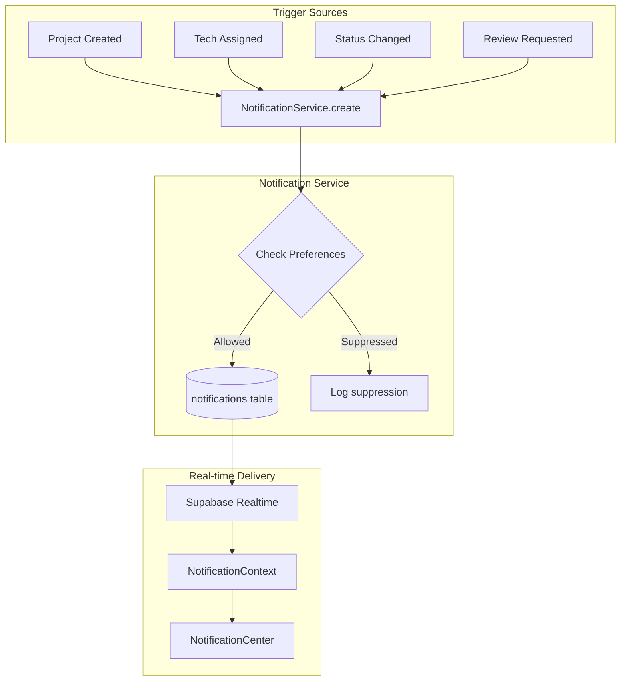

# TeraVolta Notification System

> Complete documentation of the in-app and email notification system.

---

## Overview

The notification system provides real-time in-app notifications and preference-aware email notifications for all user roles.

### Key Features

- ✅ Real-time updates via Supabase Realtime
- ✅ User preference enforcement (per-type and per-channel)
- ✅ Cross-portal support (Admin, Customer, Technician)
- ✅ Email preference integration

---

## Architecture



---

## Components

### NotificationContext

**File:** `components/NotificationContext.tsx`

Provides notification state and actions to the entire portal.

```typescript
interface NotificationContextType {
  notifications: Notification[];
  unreadCount: number;
  loading: boolean;
  markAsRead: (id: string) => Promise<void>;
  markAllAsRead: () => Promise<void>;
}
```

**Features:**
- Fetches notifications on mount
- Sets up Supabase Realtime subscription
- Auto-refreshes on database changes
- Maintains unread count

### NotificationCenter

**File:** `components/NotificationCenter.tsx`

Header dropdown component displaying notifications.

**Features:**
- Bell icon with unread count badge
- Dropdown list of recent notifications
- Click-to-navigate with auto-mark-as-read
- "Mark all as read" button
- Empty state handling
- Bilingual support (EN/ES)

### NotificationProvider

Wraps portal layouts to provide notification context:

```tsx
// In layout.tsx
<NotificationProvider>
  <YourLayout />
</NotificationProvider>
```

---

## User Preferences

### Preference Structure

Stored in `user_settings.preferences` (JSONB):

```json
{
  "in_app": true,
  "email": true,
  "types": {
    "info": true,
    "success": true,
    "warning": true,
    "error": true
  }
}
```

### Preference Enforcement

The `NotificationService.shouldSend()` method checks:

1. **Global channel toggle** (`in_app` or `email`)
2. **Type-specific toggle** (`types.info`, `types.success`, etc.)

```typescript
// Service-side check
const shouldSend = await NotificationService.shouldSend(userId, 'info', 'email');
if (!shouldSend) {
  console.log('Notification suppressed by user preference');
  return;
}
```

### Bypassing Preferences

Some critical emails bypass preferences:

| Email Type | Bypass Preferences | Reason |
|------------|-------------------|--------|
| Onboarding/Magic Link | ✅ Yes | Account access |
| Password Reset | ✅ Yes | Security |
| Status Updates | ❌ No | User-controlled |
| Review Requests | ❌ No | User-controlled |

---

## Notification Types

| Type | Icon | Color | Use Case |
|------|------|-------|----------|
| `info` | ℹ️ | Blue | General updates, assignments |
| `success` | ✅ | Green | Completed actions, approvals |
| `warning` | ⚠️ | Yellow | Attention needed |
| `error` | ❌ | Red | Failed actions, issues |

---

## API Endpoints

### Create Notification

**POST** `/api/create-notification`

Used by services to create cross-user notifications (bypasses RLS).

```json
{
  "userId": "uuid",
  "type": "info",
  "title": "New Assignment",
  "message": "You have been assigned to Project ABC.",
  "link": "/portal/technician"
}
```

---

## Integration Points

### Where Notifications Are Created

| Trigger | File | Notification |
|---------|------|--------------|
| Project created | `/api/create-project` | Customer: "Project Created" |
| Quote approved | `quotes/[id]/page.tsx` | Customer: "Quote Approved" |
| Quote rejected | `quotes/[id]/page.tsx` | Customer: "Quote Update" |
| Tech assigned | `activeProjectService.ts` | Technician: "New Assignment" |
| Appointment reassigned | `appointmentService.ts` | Technician: "Appointment Reassigned" |

### Adding New Triggers

To add a notification trigger:

```typescript
// Option 1: Client-side (same user)
import { NotificationService } from '@/app/services/notificationService';

await NotificationService.create({
  user_id: userId,
  type: 'info',
  title: 'Title',
  message: 'Message',
  link: '/path'
});

// Option 2: Server-side (cross-user)
await fetch('/api/create-notification', {
  method: 'POST',
  headers: { 'Content-Type': 'application/json' },
  body: JSON.stringify({
    userId: targetUserId,
    type: 'info',
    title: 'Title',
    message: 'Message',
    link: '/path'
  })
});
```

---

## Database Schema

### notifications table

| Column | Type | Description |
|--------|------|-------------|
| `id` | uuid | Primary key |
| `user_id` | uuid | Recipient (FK to users) |
| `type` | text | `info`, `success`, `warning`, `error` |
| `title` | text | Notification title |
| `message` | text | Notification body |
| `link` | text | Optional navigation URL |
| `read` | boolean | Read status (default: false) |
| `created_at` | timestamptz | Creation timestamp |

### RLS Policies

```sql
-- Users can only read their own notifications
CREATE POLICY "Users read own notifications"
ON notifications FOR SELECT
TO authenticated
USING (auth.uid() = user_id);

-- System can insert via service role
CREATE POLICY "Service inserts notifications"
ON notifications FOR INSERT
TO service_role
WITH CHECK (true);
```

---

## Realtime Configuration

The `NotificationContext` subscribes to Postgres changes:

```typescript
const channel = supabase.channel('notifications_std')
  .on('postgres_changes',
    {
      event: '*',
      schema: 'public',
      table: 'notifications',
      filter: `user_id=eq.${user.id}`
    },
    () => {
      // Refetch notifications
      fetchNotifications();
    }
  )
  .subscribe();
```

---

## Related Documentation

- [Services Reference](./SERVICES_REFERENCE.md) - NotificationService details
- [API Reference](./API_REFERENCE.md) - create-notification endpoint
- [Supabase Reference](./SUPABASE_REFERENCE.md) - notifications table
