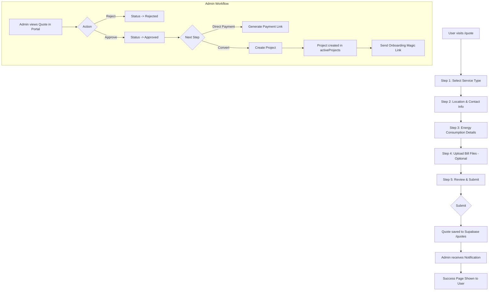
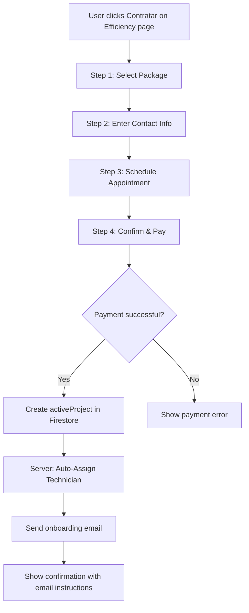
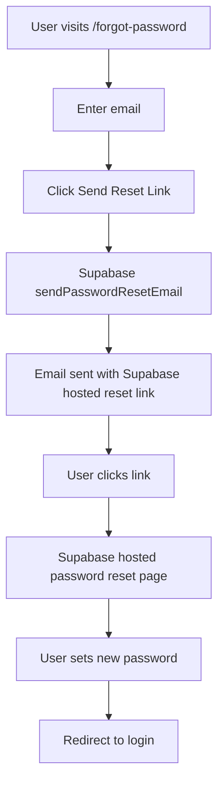
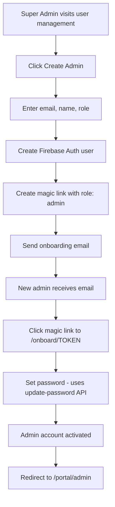
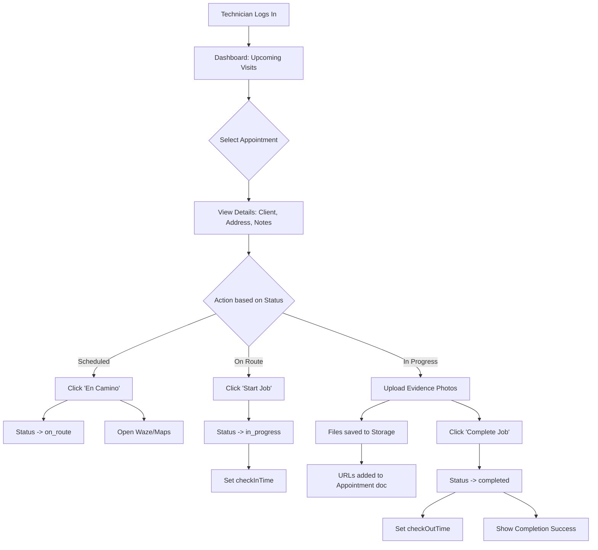

# TeraVolta User Flows

This document describes the detailed user journeys through the TeraVolta website.

---

## Table of Contents
- [Public User Flows](#public-user-flows)
  - [Quote Request Flow](#1-quote-request-flow)
  - [Service Inquiry Flow](#2-service-inquiry-flow)
  - [Energy Efficiency Direct Purchase](#3-energy-efficiency-direct-purchase)
  - [Contact Form](#4-contact-form)
- [Authentication Flows](#authentication-flows)
  - [Magic Link Onboarding](#5-magic-link-onboarding)
  - [Password Reset](#6-password-reset)
- [Customer Portal Flows](#customer-portal-flows)
  - [Customer Dashboard](#7-customer-dashboard)
- [Admin Portal Flows](#admin-portal-flows)
  - [Admin Dashboard](#8-admin-dashboard)
  - [Creating Admin Users](#9-creating-admin-users)
- [Technician Portal Flows](#technician-portal-flows)
  - [Technician Journey](#10-technician-journey-execution)

---

## Public User Flows

### 1. Quote Request Flow

**Path**: `/quote`

**Purpose**: Allow potential clients to request a detailed quote for solar/energy services.



**Quote Status Lifecycle**:
1. **pending_review**: Initial state upon submission.
2. **in_review**: Admin has opened the quote.
3. **approved**: Admin validated the request. Can now generate payment links.
4. **paid**: Client has paid the quote amount.
5. **rejected**: Quote denied.
6. **cancelled**: Quote workflow terminated.
7. **project_linked**: (Internal) Quote has been converted to an active project.

**Supabase Document** (`quotes` table):
```sql
-- quotes table structure
id: uuid
client_name: text
client_email: text
service: text
monthly_bill: text
status: text              -- 'pending_review', 'in_review', 'approved', 'rejected'
linked_project_id: uuid   -- If converted to project
payment_link: text
bill_files: jsonb         -- Array of file metadata
created_at: timestamptz
```
```

---

### 2. Service Inquiry Flow

**Path**: `/inquiry/[service]`

**Purpose**: Allow users to inquire about specific services (consulting, efficiency, advocacy).

```mermaid
flowchart TD
    A[User clicks service CTA] --> B[Redirect to /inquiry/SERVICE]
    B --> C[Fill inquiry form]
    C --> D[Attach files - Optional]
    D --> E[Submit]
    E --> F[Files uploaded to Storage]
    F --> G[Inquiry saved to Supabase /inquiries]
    G --> H[Send Admin Email (info@teravolta.com)]
    G --> I[Send Client Confirmation Email]
    H --> J[Admin replies via Zoho Mail]
    I --> K[Client receives confirmation]
    K --> L[Confirmation Page shown]
```

**UX Feedback Mechanisms**:
- **Inline Validation**: Real-time validation for all required fields.
- **Mobile Optimized**: International phone input with automatic country detection.
- **Micro-animations**: Smooth transitions between form states.

**Email Workflow**:
- **Admin Notification**: Sent to `info@teravolta.com` with full project details (Budget, Timeline, Description). This allows the admin to simply "Reply" to the email via Zoho Mail to start the conversation with the client.
- **Client Confirmation**: Sent to the user confirming receipt of their specific service request.

**Storage Path**: `/inquiries/{inquiryId}/{filename}`

---

### 3. Energy Efficiency Direct Purchase

**Path**: `/services/efficiency/contratar`

**Purpose**: Allow users to directly purchase Energy Efficiency service packages.



**UX Feedback Mechanisms**:
- **Step Tracking**: Visual progress indicator showing current step status.
- **Credit Card Formatting**: Real-time formatting for card numbers, expiry, and CVV.
- **Inline Validation**: Immediate feedback on contact information (Phone/Email) before proceeding to payment.
- **Processing States**: Secure loading overlays during payment simulation.

**Key Points**:
- Creates `activeProjects` document with `userId: null` (orphan project)
- **Auto-Assignment**: System attempts to assign a technician based on selected slot
- Orphan project is linked to user during onboarding via email match
- Confirmation page shows "Check your email for access link" instead of "Mi Cuenta" button

**Supabase Document** (`active_projects` table):
```sql
-- active_projects table structure
id: uuid
user_id: uuid             -- Linked during onboarding (nullable)
client_name: text
client_email: text
address: text
service: text             -- 'efficiency'
status: text              -- 'pending', 'active', 'completed'
scheduled_date: date
scheduled_time: time
created_at: timestamptz
```
```

---

### 4. Contact Form

**Path**: `/contact`

**Purpose**: General contact form for website visitors.

```mermaid
flowchart TD
    A[User visits /contact] --> B[Fill contact form]
    B --> C[Attach files - Optional]
    C --> D[Submit]
    D --> E[Save to /inquiries with service: contact]
    E --> F[Send Admin Email (info@teravolta.com)]
    E --> G[Send Client Confirmation Email]
    F --> H[Admin replies via Zoho Mail]
    G --> I[Show success message]
```

**Email Workflow**:
- **Admin Notification**: Sent to `info@teravolta.com`. Contains all form fields allowing the admin to "Reply" directly via Zoho Mail.
- **Client Confirmation**: Sent to the user in their selected language (EN/ES) confirming receipt.

---

## Authentication Flows

### 5. Magic Link Onboarding

**Path**: `/onboard/[token]`

**Purpose**: Allow new users (clients or admins) to activate their account via magic link.

```mermaid
flowchart TD
    A[Admin/System creates magic link] --> B[Email sent to user]
    B --> C[User clicks /onboard/TOKEN]
    C --> D{Validate token}
    D -->|Invalid| E[Show Invalid Link error]
    D -->|Expired| F[Show Expired Link error]
    D -->|Already Used| G[Show Already Used error]
    D -->|Valid| H[Show user info + password form]
    H --> I[User enters password]
    I --> J{Try createUserWithEmailAndPassword}
    J -->|Success| K[New user created]
    J -->|email-already-in-use| L[Call /api/update-user-password]
    L --> M[Password updated via Admin SDK]
    M --> N[Sign in with new password]
    K --> O[Create/update Firestore user doc]
    N --> O
    O --> P{Role from magic link?}
    P -->|customer| Q[Link orphan projects by email]
    Q --> R[Associate historical quotes]
    P -->|admin| S[Skip customer steps]
    R --> T[Mark magic link as used]
    S --> T
    T --> U[Show success + redirect button]
    U --> V{Redirect based on role}
    V -->|admin| W[/portal/admin]
    V -->|customer| X[/portal/customer]
```

When creating admin users from the dashboard, a Supabase Auth user is created before onboarding. The onboarding flow handles this:

1. Attempts to create auth user via Supabase
2. If user already exists:
   - Calls `/api/update-user-password` endpoint
   - API validates magic link token
   - Updates password via Supabase Admin
   - Signs in user with new password
3. Continues with `users` table record creation

---

### 6. Password Reset

**Path**: `/forgot-password`



---

## Customer Portal Flows

### 7. Customer Dashboard

**Path**: `/portal/customer`

**Purpose**: Allow customers to view their projects, documents, and invoices.

```mermaid
flowchart TD
    A[Authenticated customer] --> B[/portal/customer]
    B --> C[Fetch projects where userId == user.uid]
    C --> D[Display project cards]
    D --> E{User actions}
    E --> F[View project details]
    E --> G[Download documents]
    E --> H[View invoices]
    E --> I[Account settings]
```

**Data Displayed**:
- Project list with status indicators
- Documents associated with each project
- Pending/paid invoices
- Account settings

---

## Admin Portal Flows

### 8. Admin Dashboard

**Path**: `/portal/admin`

**Quote Management Logic**:
The Admin Portal (`/portal/admin/quotes/[id]`) provides two main paths for handling approved quotes:
1.  **Create Project**: Creates a record in `activeProjects` linked to the quote. Used for internal tracking before client is fully onboarded.
2.  **Accept & Send Onboarding**:
    - Creates a **Magic Link** for the client.
    - Sends a welcome email with the link.
    - Marks quote as `approved`.
    - Allows the client to log in and view their (newly created) project.

**Quote to Project Flow**:
```mermaid
flowchart TD
    A[Admin Opens Quote] --> B{Decision}
    B -->|Reject| C[Status: Rejected]
    B -->|Approve| D[Status: Approved]
    D --> E{Action}
    E -->|Create Project Only| F[Project created in system (Internal)]
    E -->|Accept & Onboard| G[Generate Magic Link]
    G --> H[Send Email to Client]
    H --> I[Client Logs In -> project is linked]
```

---

### 9. Creating Admin Users

**Flow**:


**Important**: Admin users are pre-created in Firebase Auth before onboarding. The onboarding page handles this by detecting the `auth/email-already-in-use` error and updating the password instead of creating a new user.

---

## Flow Diagrams Key

| Symbol | Meaning |
|--------|---------|
| `[ ]` | Process step |
| `{ }` | Decision point |
| `-->` | Flow direction |
| `-->|text|` | Conditional flow |

---

## Related Documentation

- [Architecture](./ARCHITECTURE.md) - Technical architecture overview
- [Deployment Checklist](../DEPLOYMENT_CHECKLIST.md) - Production deployment steps

---

## Technician Portal Flows

### 10. Technician Journey (Execution)

**Path**: `/portal/technician`

**Purpose**: dedicated interface for field technicians to view assignments, navigate to sites, and execute work order workflows with evidence collection.



**Key Features**:
*   **Role Guard**: Only users with `role: technician` can access.
*   **Security**: Can only read appointments where `technicianUid == auth.uid`.
*   **Status Logic**: Dynamic button states guide the workflow.
*   **Evidence**: Direct photo upload via camera integration.

---

### 11. Technician Management (Admin)

**Purpose**: Distinct workflows for operational monitoring vs. administrative HR management.

#### A. Operations: Monitoring & Dispatch
**Path**: `/portal/admin/technicians`

**Focus**: Daily operations, job assignment, and performance monitoring.

```mermaid
flowchart TD
    A[Ops Manager] --> B[Technician List (Operations)]
    B --> C[Select Technician]
    C --> D[Monitoring Dashboard]
    D --> E{View Data}
    E --> F[Live Status (Active/Unavailable)]
    E --> G[Current Schedule & Jobs]
    E --> H[Performance Reviews]
    E --> I[Absence History]
    
    style D fill:#e1f5fe,stroke:#01579b
```

**Key Restrictions**:
- **Read-Only**: Cannot edit technician profile details.
- **No HR Actions**: Cannot force leave or suspend technicians from here.

#### B. Management: HR & Administration
**Path**: `/portal/admin/users/technicians`

**Focus**: Account management, profile editing, and HR actions.

```mermaid
flowchart TD
    A[HR / Super Admin] --> B[Technician List (Management)]
    B --> C[Select Technician]
    C --> D[Admin Detail Page]
    D --> E{Actions}
    E -->|Edit Profile| F[Update Contact/Skills]
    E -->|Force Leave| G[Register Suspension/Sickness]
    E -->|Deactivate| H[Disable Account Access]
    
    style D fill:#fff3e0,stroke:#e65100
```

**Capabilities**:
- **Full Control**: Edit name, email, phone, specialties.
- **Force Leave**: Immediately mark a technician as unavailable (bypassing approval).
- **Security**: Deactivate accounts to revoke access.

